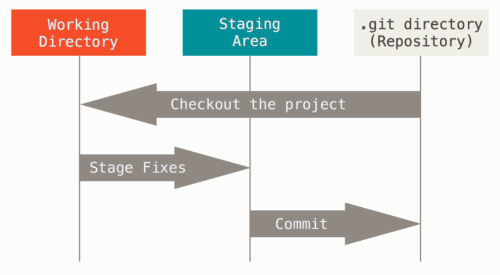

## Git 状态

#### Git 文件三种状态
- 已修改(modified)：已经修改了，但是还没保存到数据库
- 已暂存(staged)：对一个已修改文件的当前版本做了标记，使之包含在下次提交的快照中
- 已提交(committed)：数据已保存在本地数据库中

#### Git 项目三个阶段



- **工作区(Working dirctory)**：项目的某个版本内容，从 Git 仓库的压缩数据库中提取出来，存放在磁盘上。一般本地项目中，除了 .git 目录，剩下都是工作区
- **暂存区(Stage)**：也称索引区(index)，一个文件，在 .git 目录下，存放了下次要提交的文件目录信息，包含要修改文件名/文件修改时间/文件长度/文件类型/文件版本号。真正的文件内容在 .git/object 中
- **本地仓库(Repository)**: .git 目录，保存项目所有元数据和对象数据库的地方


#### Git 基本工作流程
```shell
# 1.本地修改文件，如果本地仓库没有该文件，则文件属于未索引(untracked)状态，否则是已修改(modified)状态

# 2.将工作区文件添加到暂存区，文件属于已暂存(staged)状态
git add file 

# 3.将暂存区内容添加到本地仓库，文件属于已提交(committed)状态 
git commit -m [message]
```


#### 查看状态
`git status`
`git diff` 比较工作目录和暂存区域快照之间的差异
`git diff --staged` 比较暂存区域和最后一次提交的差异
