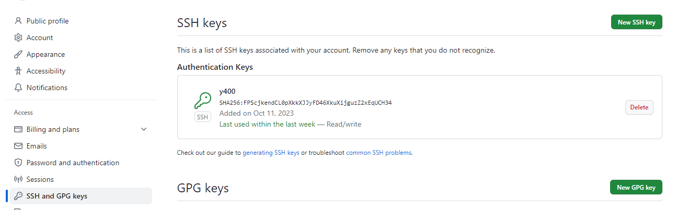

## Github 中设置 ssh 连接


1. 查看 ssh key   

    ```shell
    ls -al ~/.ssh
    # 默认支持格式为以下之一
    id_rsa.pub
    id_ecdsa.pub
    id_ed25519.pub
    ```
2. 添加 ssh key 至 github 账户
    - 将 ssh key 复制到剪切板
        - clip < ~/.ssh/id_rsa.pub
    - 点击 github 账户个人资料
        
    - 点击左侧 **SSH and GPG keys** 后，点击 **New SSH key** 新加 ssh key
        
    - **title** 栏输入自定义名称，拷贝 ssh key 至 **Key** 栏后点击 **Add SSH key**
3. 测试 ssh 连接
    - 打开 Git Bash 
    - 输入以下内容
        ```shell
        $ ssh -T git@github.com
        # Attempts to ssh to GitHub
        ```
    - 输入 yes, 得到如下即连接成功
        ```shell
        $ Hi USERNAME! You've successfully authenticated, but GitHub does not provide shell access.
        ```
4.  使用测试
    - 可以使用 SHH 进行代码仓管理
        ```shell
        # 克隆代码仓
        git clone git@github.com:wangshuai09/Notebook.git
        ```       

