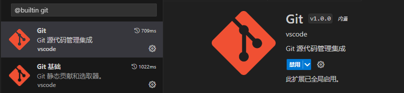

## VsCode 中设置 git

1. 启动 git 插件，扩展->筛选->内置，搜索 git 插件并启用
    
    
2. 配置 git path
    左下角设置->设置->搜索 git.path ->在 settings.json 编辑
    
    
    git path 设置为 git 安装路径
    
3. 若没有配置 github 用户信息
    ```shell
    git config user.name xxx
    git config user.email xxx
    ```
4. 项目管理
    - 打开项目文件夹
    - 修改代码
    - 打开源代码管理界面，该界面会展示所有本地存储库的修改
        
    - \+ 号 = git add  
    - 消息框为 commit 信息，√ 号 = git commit '消息框信息'
