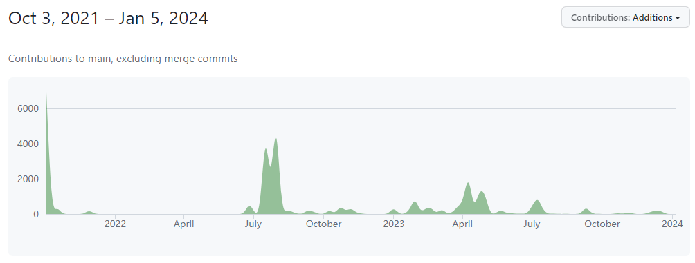
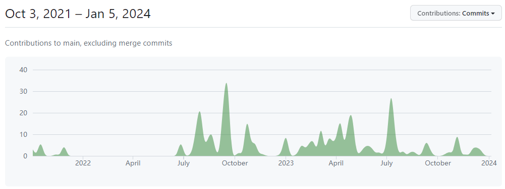

### bitsandbytes 洞察

#### 背景

bitsandbytes 是由一位PHD及hugging face/meta 合作开源一个项目。由对 CUDA 自定义函数的轻量化封装实现 8-bit 优化器，LLM.INT8(), 量化函数等。利用该库可以在不降低模型性能的情况下，实现模型占用内存的大幅降低。当前该库已整合入 HuggingFace transformers 中，适用所有 HuggingFace 模型。

#### 发布策略

无规律发布计划，近期发布版本及时间如下：

| 版本号 | 发布时间 | 间隔 |
| :----: | :----: | :----: |  
| 0.41.0 | 7.23 | - |
| 0.40.0 | 7.12 | 11天 |
| 0.39.1 | 6.20 | 22天 |
| 0.38.0 | 4.12 | 2个月 |
| 0.37.0 | 2.2 | 2个月 |

#### 社区发展
Star数： 4.6k 
开发者数量：47，其中超过百行代码贡献人数为 9

社区代码量贡献

社区commits贡献

#### 社区运作
通过 github issues/discussions 进行沟通

#### 依赖
torch, CUDA

#### 昇腾接入方式
该项目通过编译选项控制不同的版本，不能动态控制后端，昇腾可实现算子后通过编译控制接口。
需实现算子约 30 个（https://github.com/TimDettmers/bitsandbytes/blob/main/csrc/ops.cuh）
