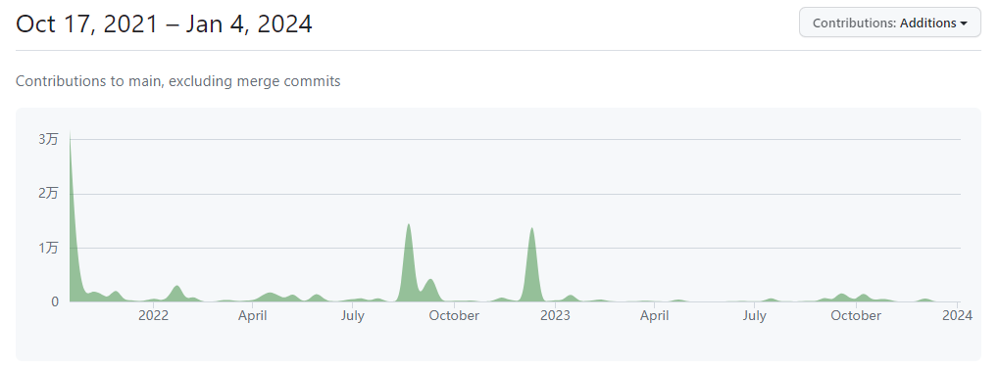
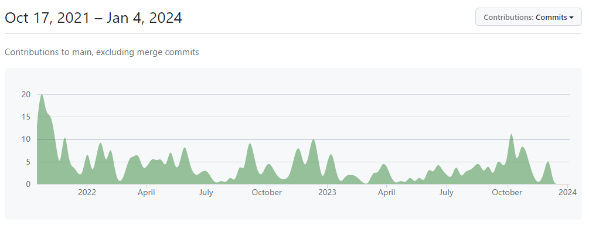

### xFormers 洞察

#### 背景

xFormers 是由 meta 主导的关于 transformers 的开源训练/推理加速库。该库基于 pytorch 框架提供一些关于 transformers 的高效算子或者一些尚未在主流框架（PyTorch）实现的前沿技术。Baichuan, Llama 等各种 transformer 架构的模型都可以使用 xFormers 提供的 memory_efficient_attention 等操作实现更省内存且更快的计算。

#### 发布策略

对于细微的更改和改进将会持续发布，对于大粒度的改进将更定期的发布。
近期发布版本及时间如下：

| 版本号 | 发布时间 | 间隔 |
| :----: | :----: | :----: |  
| v0.0.23 | 12.07 | - |
| v0.0.22 | 9.27 | 两个半月 |
| v0.0.21 | 8.18 | 一个半月 |
| v0.0.20 | 5.24 | 三个月 |
| v0.0.19 | 4.28 | 一个月 |

#### 社区发展
Star数： 6.7k 
开发者数量：68，其中超过百行代码贡献人数为 25

社区代码量贡献

社区commits贡献

#### 社区运作
通过 github issues/discussions进行沟通

#### 依赖
torch, cutlass, triton(可选), flash-attention(可选)

#### 昇腾接入方式
该项目实现了 transformer 相关的算子，包括 cuda/cpu 实现和部分 triton 实现。
cpu 和 cuda 使用 pytorch 算子注册方式进行接入，昇腾也可采用该方式进行实现。
需实现算子数量约 25 个
